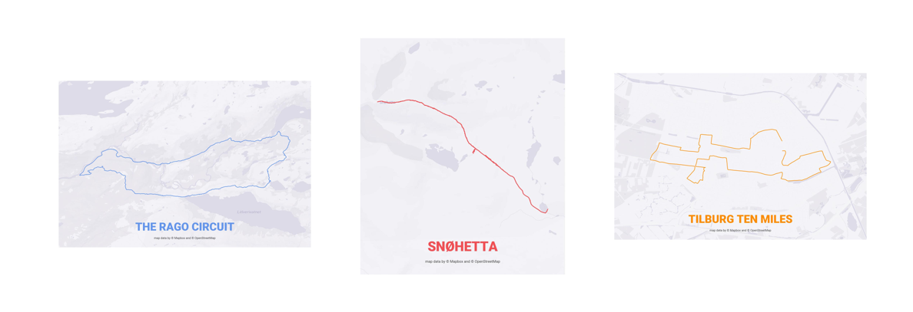
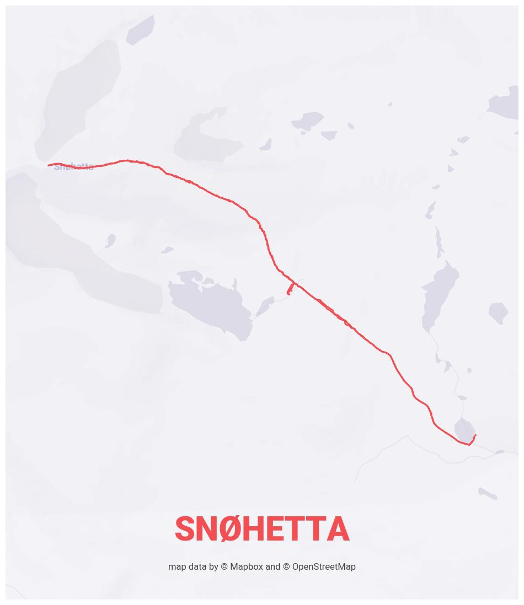
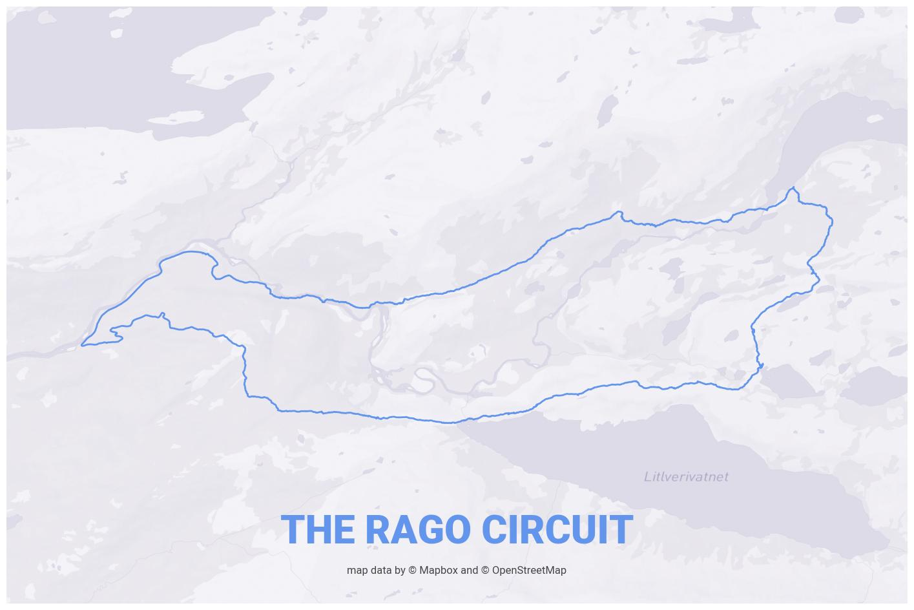
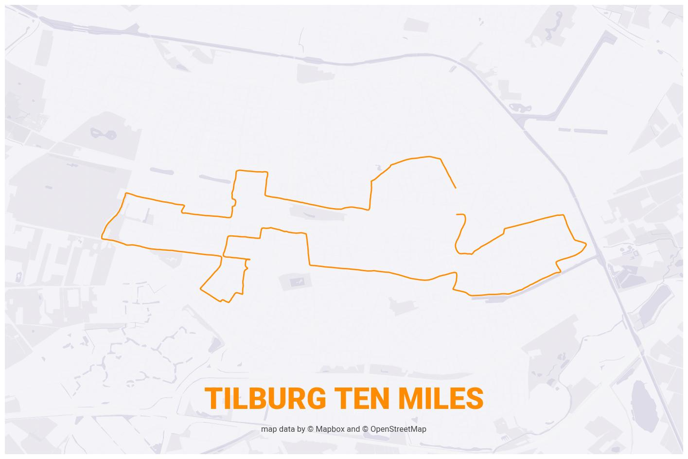

# Plot a GPX route on a map with Matplotlib and Mapbox
This repository offers users an easy way to generate a themed route plot based on GPX data. 

To do so, it combines good-old Matplotlib for visualising the data and the Mapbox Static Images API to generate relevant background maps.



## 0. Requirements

To plot a route on a map, you need a `mapbox_access_token` to connect to the Mapbox Static Images API ([more info](https://docs.mapbox.com/api/maps/static-images/)).

Besides that, you (of course) need to install the required python packages. 

After that, you are good to go. 

## 1. Basic usage

Plotting a route on a map is easy:

``````python
gpx_map = GpxOnMap()
gpx_map.mapbox_access_token = your_mapbox_access_token
gpx_map.plot_gpx_on_map(
    path_to_gpx='snohetta.gpx',
    route_title='SNØHETTA',
)
``````

## 2. Optional settings

There are some settings that you can change to make it fit your use-case.

### 2.1 File name & theme

For example, you can specify where to save the image and change the Mapbox theme:

`````` python
...
gpx_map.output_file_name = 'images/snohetta.jpg'
gpx_map.mapbox_style = 'edriessen/clnymoa2t005101qx2du81zcr'
gpx_map.plot_gpx_on_map(
    path_to_gpx='snohetta.gpx',
    route_title='SNØHETTA',
)
``````

This results in the following image:



### 2.2 Changing the output image size

You can also modify some of the matplotlib settings, like colours and image size. 

To change the image size, make sure that the aspect ratio of the background image (`background_image_width` and `background_image_height`) match the aspect ratio of the figsize of the plot (`(width, height)`). 

By default, these are set to:

- `background_image_width`: 600
- `background_image_width`: 700
- `fig_size`:  (12,14)

*Review the [Mapbox docs](https://docs.mapbox.com/api/maps/static-images/) for limitations on image width and hight.*

So when you only change the `background_image_width` to 900, make sure to set a correct `fig_size` as well, otherwise the image of the map will look distorted. 

```python
gpx_map = GpxOnMap()
gpx_map.output_file_name = 'images/ragocircuit.jpg'
gpx_map.theme_primary_color = 'cornflowerblue'
gpx_map.background_image_width = 900
gpx_map.fig_size = (18, 14)
gpx_map.plot_gpx_on_map('ragocircuit.gpx', 'THE RAGO CIRCUIT')
```

This example, if you have the gpx file of course, results into this plot:



Ah, The Rago Circuit is such a nice hike! :-)

### 2.3 Plot margin

You can also change the margin the route should have. The default value is `0.1` or 10%. 

````` python
gpx_map.output_file_name = 'images/tilburgtenmiles.jpg'
gpx_map.theme_primary_color = 'darkorange'
gpx_map.route_margin = .2
gpx_map.plot_gpx_on_map('tilburgtenmiles.gpx', 'TILBURG TEN MILES')
`````


Here's the example of a running event I attended in my city:



## Credits

Many thanks to:

- [Mapbox](https://www.mapbox.com/) for providing an intuitive way to style and use custom maps.
- [Andrew Lavers](https://stackoverflow.com/questions/53697724/getting-distance-from-longitude-and-latitude-using-haversines-distance-formula) for providing a Python function to calculate haversine distances between points on our globe. 
- [Garmin](https://www.garmin.com/nl-NL/) for providing an easy way to track my hikes and runs.  
- [Matplotlib](https://matplotlib.org/) for being an awesome dataviz package. 

## Contact

Don't hesitate to reach out if you have any questions or suggestions!
